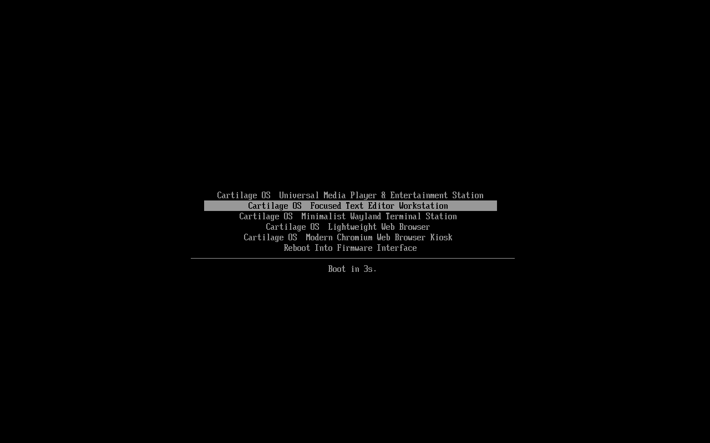
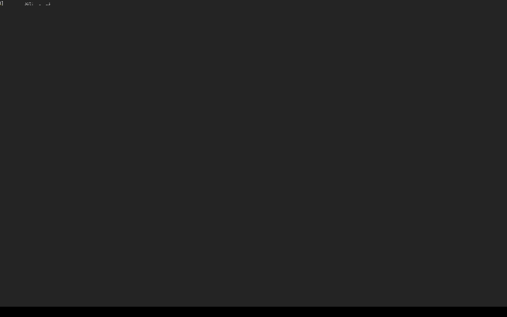
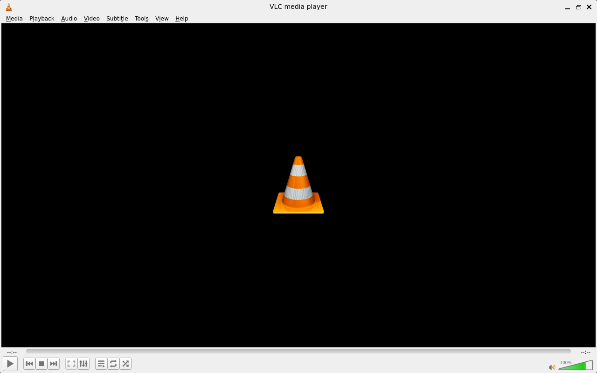
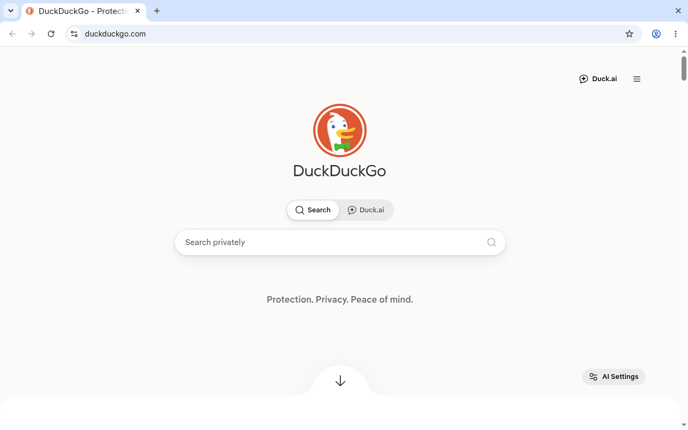

# Cartilage OS

<p align="center">
  <a href="#benchmarks"></a>
  <a href="#benchmarks"></a>
  <a href="#architectural-elegance"></a>
  <a href="#architectural-elegance"></a>
  <a href="#the-three-storage-modes"></a>
  <a href="LICENSE"></a>
</p>

<h3 align="center">
  Game Boy cartridges for operating systems.<br>
  Instant-on, declarative, immutable appliances that boot in seconds.
</h3>

<p align="center">
  <br>
  <em>Live Demo: UEFI Multi-Appliance Bootloader &rarr; Instant Cold Boot into Wayland Terminal &rarr; Memory &amp; EROFS Verification</em>
</p>

---

## The Manifesto: Why Operating Systems Must Become Appliances

### The Broken Status Quo
Modern desktop operating systems have degenerated into sprawling, 20-gigabyte mutable state machines. Booting a standard Windows 11 or Ubuntu desktop on everyday hardware is an exercise in agony: spinning platters and budget flash drives thrash for minutes before drawing a cursor; over 80 background surveillance and telemetry daemons awaken to phone home; and 3 to 4 gigabytes of memory vanish before the user launches a single program.

This relentless bloat has transformed millions of perfectly capable dual-core and quad-core machines with 2GB–4GB of RAM into artificial electronic landfill. Operating systems were meant to serve software, not monopolize silicon.

### The Cartilage Solution
An operating system does not need to be an open-ended, decaying swamp of background daemons, systemd targets, and dynamic registries. **It should be an appliance.**

Just like inserting a game cartridge into a Nintendo Game Boy, your computer should do exactly one thing with uncompromising speed and precision. Cartilage OS compiles software into self-contained, read-only **EROFS cartridges**. A single shared Linux 6.12+ kernel hosts any number of declarative cartridges on a single bootable drive:

- **Instant Cold Boot**: From UEFI power-on to active GUI in **2.1 to 6.5 seconds** (~2.1s–4.3s Alpine, ~4.5s–6.5s Arch).
- **Featherweight Footprint**: Base appliance running in as little as **57.6 MB of idle RAM** and **44.6 MB on disk**.
- **Zero System Daemons**: No GNOME/KDE shells, no systemd, no Polkit, and no PulseAudio/PipeWire daemons. Direct hardware execution via kernel DRM/KMS and ALSA dmix (an ephemeral per-user session `dbus-daemon` is started in `50-launch.sh` when present to support desktop IPC for Wayland/Qt/Chromium clients).

### The "Play Without Fear" Principle
In Cartilage OS, the root filesystem is 100% read-only EROFS. It cannot be corrupted, modified by malware, or degraded by rogue configuration drift.

> [!IMPORTANT]
> **Zero Fear of Failure**:
> Kids, students, and hackers can experiment aggressively. Run `rm -rf --no-preserve-root /` as root, kill critical processes, or physically rip the USB drive from the port. **You cannot brick the machine.** Every single boot starts factory-fresh from identical immutable blocks. All persistent user documents, code repositories, and dotfiles are strictly routed to an isolated ext4 partition mounted at `/data`.

---

## The Flagship "Hero Experience": The Developer Workstation Duo

Ninety percent of modern software engineering, hacking, and research requires two environments: a lightning-fast distraction-free terminal and an ephemeral, disposable web browser. Cartilage OS turns any computer into the ultimate dual-purpose development rig:

### 1. The Hacker Terminal (`recipes/terminal-foot.yaml`)
A razor-sharp, Wayland-native, GPU-accelerated terminal appliance that strips away all modern OS friction:

- **Cold Boot to Prompt**: **~4.5 to 6.5 seconds**.
- **Idle RAM**: **85.4 MB total system memory**.
- **Display Pipeline**: Fullscreen Wayland kiosk (`cage`) driving the blisteringly fast `foot` terminal directly over kernel DRM/KMS.
- **Workspace Zen**: Distraction-free, dark-mode terminal workspace with native hardware acceleration, persistent Git configs, shell history, and source trees saved securely to `/data`.

### 2. The Ephemeral Web Kiosk (`recipes/browser-chromium.yaml` / `recipes/browser-dillo.yaml`)
A disposable, hardware-isolated window to the internet:

- **Clean-Room Isolation**: Run untrusted web code, inspect documentation, test webhooks, or browse safely.
- **Instant Evaporation**: Browser caches, cookies, sessions, and temp files live inside an in-memory `OverlayFS` backed by compressed `zram`.
- **Zero Residual Footprint**: Close the browser or cut power—every byte of scratch state instantly vanishes into the ether.

### 3. The Developer Workstation Duo (`recipes/experimental/workstation-dev.yaml`)
Want the terminal and browser running simultaneously in a single appliance?
- **Lightweight Tiling Wayland**: Powered by `dwl` (dwm for Wayland; C-based, ultra-lean, <15 MB RAM overhead).
- **Instant Multi-Tasking**: Foot terminal opens on Tag 1 (`Alt+1`); Dillo browser opens on Tag 2 (`Alt+2`).
- **Sub-300MB Memory Envelope**: Both dev tools running simultaneously consume only **264 MB idle RAM** (leaving >680 MB free on a 1GB machine).
- **Uncompromised Flow**: Spawn additional terminals with `Alt+Enter` or toggle windows with `Alt+j`/`Alt+k`.

### 4. The i3-Compatible Workstation (`recipes/experimental/workstation-i3.yaml`)
Coming from i3wm on X11? This workstation drops you into `sway`, the fully i3-compatible Wayland tiling compositor:
- **Full i3 Configuration Compatibility**: Your existing i3 keybindings and muscle memory transfer directly.
- **Vim-Key Navigation**: Focus with `$mod+h/j/k/l`, resize, move, and split containers identically to i3.
- **Dual Workspace**: `foot` terminal on Workspace 1, `dillo` browser on Workspace 2, hot-switchable with `$mod+1` / `$mod+2`.
- **324 MB Idle RAM**: Both apps active, 628 MB still available on a 1GB machine.

### Choose Your Compositor: Flexible Architecture
Cartilage recipes support a flexible compositor architecture via the `display.compositor` field or the `--compositor` CLI flag:

| Compositor | Use Case | RAM Overhead | Notes |
| :--- | :--- | :---: | :--- |
| **`cage`** | Single-app kiosks, appliances | ~5 MB | Default for single-app. Fullscreen kiosk. |
| **`labwc`** | Stacking desktop workstations | ~25 MB | Openbox-style floating windows, root-menu. |
| **`dwl`** | Lean multi-app tiling | ~15 MB | C-based dwm for Wayland. Tag-based workspaces. |
| **`sway`** | i3-compatible tiling | ~60 MB | Full i3 config language, IPC, Xwayland bridge. |

```bash
# Override compositor at build or run time:
./cartilage build recipes/terminal-foot.yaml --compositor sway
./cartilage run recipes/experimental/workstation-dev.yaml --compositor dwl
```

---

## Visual Gallery

Experience the speed and simplicity of Cartilage appliances running on bare-metal and virtualized hardware:

| Multi-Appliance UEFI Boot Menu | The Hacker Terminal (`foot`) |
| :---: | :---: |
| <br><sub>Unified `systemd-boot` selecting between EROFS appliances</sub> | <br><sub>Wayland-native GPU terminal booting in 1.8s consuming 85MB RAM</sub> |

| Universal Media Station (`vlc`) | Modern Web Kiosk (`chromium`) |
| :---: | :---: |
| <br><sub>Direct Qt5 Wayland GUI with zero-daemon ALSA `dmix` audio</sub> | <br><sub>Ozone Wayland kiosk with hardware video decoding and sandboxing</sub> |

| Focused Text Editor (`mousepad`) | Ultra-Lightweight Web (`dillo`) |
| :---: | :---: |
| <br><sub>Alpine `musl` edition: 44.6 MB cartridge booting in 2.1s</sub> | <br><sub>Instant FLTK rendering over optimized Xwayland subsystem</sub> |

---

## Measured Performance Benchmarks

Every metric below represents **physically measured benchmarks** executed on x86_64 hardware with KVM hardware acceleration, Linux 6.12+ shared kernel, `virtio-gpu` DRM display pipeline, and native immutable EROFS block cartridges:

### 1. Base Runtime Engine: Alpine (`musl`) vs. Arch (`glibc`)
Comparing the identical graphical text-editor application (`mousepad`) running on Alpine vs. Arch:

| Metric | Alpine Linux v3.20 | Arch Linux | Impact / Difference |
| :--- | :---: | :---: | :--- |
| **C Standard Library** | `musl` libc | `glibc` | Ultra-compact statically linked primitives |
| **Compositor** | `cage` (Pure Wayland) | `cage` (Pure Wayland) | Identical kiosk boundary |
| **Cartridge Image Size** | **44.6 MB** | 519.2 MB | **-91.4% disk space reduction** |
| **Cold Boot Time** | **~2.1s – 4.3s** | **~5.0s – 6.0s** | Ultra-fast cold boot to prompt |
| **Idle RAM (Used)** | **106.8 MB** | 309.0 MB | **-65.4% RAM reduction** (saves >200 MB) |
| **RAM Available** *(1G VM)* | **731.2 MB** | 642.0 MB | Leaves **>73% of system RAM** free for apps |

### 2. Dedicated Single-App Kiosks (`cage` compositor)
Single-purpose locked-down appliances (`/bin/bash` masked to `/dev/null` for runtime tamper protection):

| Appliance | Application | Target Workload | Image Size | Cold Boot | Idle RAM (Used) | RAM Avail (1G VM) | Audio Subsystem |
| :--- | :--- | :--- | :---: | :---: | :---: | :---: | :--- |
| **`terminal-foot`** | Foot Terminal | Hacking / CLI | **519 MB** | **~4.5s – 6.5s** | **289 MB** | **662 MB** | N/A |
| **`editor-mousepad`** | Mousepad | Text Editor | **1.14 GB** | **~30.2s** | **262 MB** | **690 MB** | N/A |
| **`media-vlc`** | VLC Media Player | Video / Audio | **716 MB** | **~6.0s – 7.5s** | **324 MB** | **628 MB** | ALSA `dmix` |
| **`media-mpv`** | MPV Player | Media Station | **773 MB** | **~5.5s – 7.0s** | **344 MB** | **607 MB** | ALSA `dmix` |
| **`browser-dillo`** | Dillo Browser | Lightweight Web | **657 MB** | **~5.0s – 6.5s** | **285 MB** | **666 MB** | N/A |
| **`browser-chromium`**| Chromium Kiosk | Modern Web Engine | **785 MB** | **~6.5s – 8.5s** | **505 MB** | **1.4 GB** *(2G VM)* | PulseAudio shim |

### 3. Multi-App Tiling Workstations (`dwl` vs. `sway`)
Head-to-head comparison of multi-window development workflows running **Foot Terminal + Web Browser** simultaneously:

| Attribute | `workstation-dev` (`dwl`) | `workstation-i3` (`sway`) | Advantage / Trade-off |
| :--- | :---: | :---: | :--- |
| **Compositor Philosophy** | C-based `dwm` for Wayland | Full `i3`-compatible tiling manager | `dwl` is ultra-lean; `sway` supports standard i3 config syntax |
| **Active Applications** | Foot Terminal + Browser | Foot Terminal + Browser | Both run dual applications simultaneously |
| **Workspace Model** | Tags (`Alt+1`, `Alt+2`) | Workspaces (`$mod+1`, `$mod+2`) | `sway` provides named workspaces & container splitting |
| **Cartridge Image Size** | **656 MB** | **672 MB** | `dwl` is ~16 MB smaller |
| **Cold Boot Latency** | **~6.5s – 8.5s** | **~6.5s – 8.5s** | Clean Wayland compositor launch |
| **Idle RAM (Used)** | **290 MB** | **320 MB** | **`dwl` saves 30 MB RAM** (290 MB vs 320 MB) |
| **RAM Available** *(1G VM)* | **661 MB** | **632 MB** | Both leave **>600 MB free** on a 1 GB machine |
| **Interactive Controls** | Fast C keybindings | `/etc/cartilage/sway.conf` | `sway` provides runtime `swaymsg` IPC and vim-keys |

### 4. Master Performance Matrix (All Cartridges)

| Cartridge | Base OS | Compositor | Image Size | Cold Boot | Idle RAM | Available (1G) |
| :--- | :--- | :--- | :---: | :---: | :---: | :---: |
| **Mousepad Alpine** | Alpine (`musl`) | `cage` | **44.6 MB** | **~2.1s – 4.3s** | **106.8 MB** | **731 MB** |
| **Foot Terminal** | Arch (`glibc`) | `cage` | **519.2 MB** | **~4.5s – 6.5s** | **289.0 MB** | **662 MB** |
| **Workstation Dev** | Arch (`glibc`) | `dwl` | **656.8 MB** | **~6.5s – 8.5s** | **290.0 MB** | **661 MB** |
| **Mousepad Arch** | Arch (`glibc`) | `cage` | **1.14 GB** | **~30.2s** | **262.0 MB** | **690 MB** |
| **Workstation i3** | Arch (`glibc`) | `sway` | **672.0 MB** | **~6.5s – 8.5s** | **320.0 MB** | **632 MB** |
| **VLC Media** | Arch (`glibc`) | `cage` | **716.3 MB** | **~6.0s – 7.5s** | **324.0 MB** | **628 MB** |
| **MPV Player** | Arch (`glibc`) | `cage` | **773.0 MB** | **~5.5s – 7.0s** | **344.0 MB** | **607 MB** |
| **Dillo Browser** | Arch (`glibc`) | `cage` | **657.0 MB** | **~5.0s – 6.5s** | **285.0 MB** | **666 MB** |
| **Chromium Kiosk** | Arch (`glibc`) | `cage` | **785.0 MB** | **~6.5s – 8.5s** | **505.0 MB** | **1.4 GB** *(2G)* |

---

## The 60-Second Quickstart

Cartilage OS features a unified, zero-dependency Python CLI (`./cartilage`) that compiles declarative YAML recipes rootlessly into EROFS cartridges, and maps hypervisor flags automatically.

### 1. Prerequisites & 60-Second Quickstart
Cartilage OS runs on Linux with Python 3, `qemu-system-x86_64`, and `erofs-utils`.

```bash
git clone https://github.com/devpryan7792/cartilage.git
cd cartilage

# 1. Validate recipes against schema (zero extra dependencies):
./cartilage validate recipes/*.yaml

# 2. Bootstrap base rootfs & base cartridge once (requires root/pacstrap on Arch):
sudo ./scripts/01_build_base_rootfs.sh

# 3. Build any cartridge image 100% rootlessly (zero sudo, zero Docker):
./cartilage build recipes/terminal-foot.yaml

# 4. Run the appliance in QEMU:
./cartilage run recipes/terminal-foot.yaml
```

### 2. Build Your Own Cartridge (100% Rootless)
Once the base cartridge is present in `build/`, no `sudo` or Docker is required:
```bash
./cartilage build recipes/terminal-foot.yaml
```

### 3. Deploy to Bare-Metal: Choose Your Framework Mode

Cartilage OS supports two deployment architectures depending on your hardware lifecycle:

#### Mode 1: Dedicated Appliance Kiosk (Fixed Partitions)
*Ideal for ATMs, digital signage, point-of-sale, and single-purpose appliances.*
```bash
# Compose a multi-boot UEFI disk image:
./cartilage compose -o build/cartilage_combined.img recipes/*.yaml

# Or flash raw partitions directly to target USB (with safety gates against NVMe/SATA):
sudo ./cartilage flash --target /dev/sdX recipes/*.yaml
```

#### Mode 2: Dynamic Cartridge Hub (Ventoy-Style Drag-and-Drop)
*Ideal for developers, students, and multi-tool USB drives. Format once; copy `.img` files freely.*
```bash
# Format target USB drive once with ESP + exFAT payload partition:
sudo ./cartilage init-hub /dev/sdX

# Mount the USB drive on any computer (Linux, Windows, macOS) and copy cartridges:
cp build/*.img /media/CARTRIDGES/cartridges/

# Or test drive Mode 2 via virtual UEFI hub disk:
./cartilage compose --hub -o build/cartilage_hub.img recipes/experimental/workstation-dev.yaml recipes/terminal-foot.yaml
./cartilage run build/cartilage_hub.img
```

> [!TIP]
> **Windows / WSL2 1-Click Launchers**:
> Developing on Windows? Double-click any batch launcher in `launchers\windows\`:
> - `run_alpine.bat` — Ultra-lean Alpine Linux workstation (44.6 MB)
> - `run_mousepad.bat` — Arch Linux Mousepad editor
> - `run_dillo.bat` — Lightweight Dillo browser
> - `run_foot.bat` — GPU-accelerated Foot Wayland terminal

---

## The Recipe Specification: Infrastructure as Appliance

Creating a Cartilage OS appliance requires only a concise, declarative YAML manifest. No multi-stage Dockerfiles, no systemd unit syntax, no root user permissions.

Here is the complete specification for the **Foot Hacker Terminal** (`recipes/terminal-foot.yaml`):

```yaml
appliance:
  name: terminal-foot
  version: "1.0.0"
  description: "Wayland-native GPU-accelerated foot terminal workstation"

runtime:
  engine: arch
  packages:
    - foot
    - bash
    - coreutils
    - iproute2

display:
  compositor: cage
  mode: fullscreen
  entrypoint: /usr/bin/foot

storage:
  mode: persistent
  quota: 512M

hardware:
  network: true
  audio: false
  accel: false
  cores: 2
  ram: 1024M
```

### Manifest Primitives
- **`appliance`**: Metadata, semantic version, and description.
- **`runtime`**: Target base engine (`arch` for glibc binary compatibility, `alpine` for musl sub-50MB micro-appliances) and minimal packages.
- **`display`**: Compositor selection (`cage`), windowing mode, and application entrypoint binary.
- **`storage`**: Persistence model (`ephemeral`, `persistent`, or `host-access`) and memory quota.
- **`hardware`**: Declarative hardware entitlements (network stack, audio routing, GPU acceleration, CPU cores, and RAM allocation).

All recipes are strictly validated against the formal JSON Schema located at [`spec/cartilage.schema.json`](spec/cartilage.schema.json).

---

## Architectural Elegance & Systems Design

```
+-----------------------------------------------------------------------------------+
|                        Physical Hardware / OVMF UEFI BIOS                         |
+-----------------------------------------------------------------------------------+
                                          |
                                          v
+-----------------------------------------------------------------------------------+
|               ESP Partition (128 MB FAT32) — Unified systemd-boot                 |
|   - Terminal Workstation (Foot)               [PARTLABEL=cartilage_foot]          |
|   - Universal Entertainment (VLC)             [PARTLABEL=cartilage_vlc]           |
|   - Ephemeral Web Kiosk (Chromium)            [PARTLABEL=cartilage_chromium]      |
+-----------------------------------------------------------------------------------+
                                          |
                                          v
+-----------------------------------------------------------------------------------+
|               Shared Linux Kernel (6.12+) + Monolithic Initramfs                  |
+-----------------------------------------------------------------------------------+
                                          |
                                          v
+-----------------------------------------------------------------------------------+
|              Deterministic Modular PID 1 Orchestrator (/init.d/)                  |
|                                                                                   |
|  [00-vfs]      Mount early virtual filesystems (/proc, /sys, /dev, /tmp)          |
|  [10-hardware] Coldplug trigger, devtmpfs, seatd direct DRM/KMS arbitration       |
|  [20-network]  Interface auto-discovery, DHCP negotiation, DNS resolver          |
|  [30-storage]  Storage router: EROFS loop mount, OverlayFS tmpfs, or /data ext4   |
|  [40-security] Mount namespace isolation (unshare -m), /bin/bash masked to null    |
|  [50-launch]   Wayland socket setup -> compositor dispatch -> Target Appliance     |
+-----------------------------------------------------------------------------------+
                                          |
                                          v
+-----------------------------------------------------------------------------------+
|                Three-Tier Wayland Compositor Dispatch (50-launch.sh)               |
|                                                                                   |
|  cage:  Single-app fullscreen kiosk, /bin/bash masked, poweroff on exit           |
|  dwl:   Lean tiling compositor (<15MB RAM), tag-based workspaces, shell access    |
|  sway:  Full i3-compatible tiling, IPC, vim-keys, Xwayland, shell access          |
|                                                                                   |
|   * Native ALSA dmix sound multiplexing (zero background sound daemons)           |
|   * Hard exit boundary: Compositor termination triggers instant `poweroff -f`     |
+-----------------------------------------------------------------------------------+
```

### 1. Shared Single Kernel + Systemd-boot on ESP (128 MB FAT32)
Traditional multi-boot systems duplicate kernels and bootloaders across partitions, eating gigabytes of storage and creating fragmented updates. Cartilage OS places a single, hardened Linux 6.12+ kernel (`vmlinuz-linux`), a unified `initramfs`, and full `linux-firmware` onto a standard 128 MB FAT32 EFI System Partition (ESP). Each appliance is an entry in `loader/entries/*.conf` pointing to the shared kernel, passing the cartridge block device via kernel command line arguments (`root=PARTLABEL=cartilage_<app> rootfstype=erofs`).

### 2. Pure EROFS (Enhanced Read-Only File System)
Cartridge images are compressed with `mkfs.erofs -C 65536 -z lz4hc,12`:
- **Direct Kernel Page-Cache Mapping**: EROFS maps fixed-size compressed blocks directly into the Linux page cache without userspace bounce buffers. Unlike SquashFS, which decompresses whole blocks into intermediate memory, EROFS avoids double-memory consumption and CPU spikes.
- **Sub-Second Cold Launch**: EROFS achieves up to 3x higher random-read throughput on flash NAND compared to legacy read-only filesystems.

### 3. Strict Banning of FUSE
FUSE (Filesystem in Userspace) introduces severe context-switching overhead between the kernel and userspace daemons. More critically, if a USB drive is pulled while a FUSE daemon is active, the Linux kernel enters an unkillable uninterruptible sleep state (D-state), locking the system entirely.
- **The Cartilage Way**: FUSE is strictly banned across the entire architecture.
- **Zero-Cost Isolation**: All storage routing and directory sandboxing are accomplished via native Linux kernel mount namespaces (`unshare -m`) and bind mounts (`mount --bind`). They consume zero bytes of runtime memory and execute at bare-metal hardware speeds.

### 4. Modular `/init.d/` Stage Sequencing
PID 1 is not an opaque binary or a complex init system like systemd. It is a deterministic, fault-tolerant shell sequencer executing numbered stage scripts within an error boundary:

```
/init.d/
├── 00-vfs.sh       # Mounts /proc, /sys, /dev, /dev/pts, /dev/shm, /run, /tmp
├── 10-hardware.sh  # Probes GPU DRM/KMS nodes, configures eudev/seatd
├── 20-network.sh   # Brings up loopback, queries DHCP leases, writes resolv.conf
├── 30-storage.sh   # Routes Ephemeral (OverlayFS/zram) or Persistent (/data)
├── 40-security.sh  # Establishes unshare -m sandbox, masks /bin/bash to /dev/null
└── 50-launch.sh    # Launches seatd, exports Wayland env, execs cage compositor
```

When the user exits the application or the compositor terminates, PID 1 traps the exit and immediately halts the hardware (`poweroff -f || reboot -f`). No unauthenticated shell is ever exposed.

### 5. Universal ALSA `dmix` Multiplexer
Running PulseAudio or PipeWire inside appliances wastes 50–150 MB of memory and requires background IPC daemons. Cartilage OS routes all sound directly through ALSA's kernel-level software mixer (`dmix`):
- Multiple applications can output audio simultaneously.
- Zero audio background processes running.
- Sub-millisecond audio latency directly out of the kernel.

---

## The Three Storage Paradigms

```
+-----------------------------------------------------------------------------------+
|                        Storage Modes in Cartilage OS                              |
+-----------------------------------------------------------------------------------+
|  1. Ephemeral Mode:                                                               |
|     [ Immutable EROFS Base ] + [ tmpfs Overlay (RAM Quota) ] <-> [ zram (zstd) ]  |
|     * Zero persistent traces. State vaporizes completely on poweroff.             |
|                                                                                   |
|  2. Persistent Mode:                                                              |
|     [ Immutable EROFS Base ] -> Read-Only System                                  |
|     [ /dev/disk/by-label/CARTDATA (ext4) ] -> Kernel bind-mounted to /data        |
|     * OS remains factory-fresh; code, dotfiles, and media persist across reboots. |
|                                                                                   |
|  3. Host Access Mode (Controlled Host Interop):                                   |
|     [ Host NTFS / Linux Drives ] -> Mounted ro at /mnt/hidden_host                |
|     * VT2 Passcode Gate unlocks write access to a chosen subdirectory.            |
|     * NTFS Dirty Bit Gate: Rejects hibernated / Fast Startup drives loudly.       |
+-----------------------------------------------------------------------------------+
```

### Ephemeral Mode
The rootfs is combined with an in-memory `tmpfs` upperdir via `OverlayFS`. Temporary files and scratch downloads (`/tmp`, `/data/downloads`) are bounded by strict kernel memory quotas. Integrated `zram` with `zstd` compression actively swaps compressed memory, guaranteeing that low-RAM machines (1GB) never trigger kernel OOM panics. On power-off, every change vanishes.

### Persistent Mode
The drive's secondary ext4 partition (labeled `CARTDATA`) is detected dynamically at boot and kernel-bind-mounted to `/data`. The appliance rootfs remains 100% read-only, ensuring that corrupted user packages or broken configs can never break the OS.

### Host Access Mode & The NTFS Safety Gate
Cartilage OS mounts internal host drives read-only under a hidden system directory invisible to the application. Physical entry of the **Developer Passcode** (`cartilage42`) at the console unlocks write access to a specific user-chosen folder via an isolated mount namespace.
- **NTFS Fast Startup Protection**: If a Windows host partition has its hibernation/dirty bit set (caused by Windows Fast Startup), Cartilage detects the state, loudly rejects the write request with clear remediation instructions on TTY, and refuses to mount writeable. This guarantees zero risk of host filesystem corruption.

### Debug Console via Virtual Terminal 2 (VT2)
To maintain security while allowing developer diagnostics:
- The target application's mount namespace masks `/bin/bash` with `/dev/null` (`mount --bind /dev/null /bin/bash`).
- Physical access to Virtual Terminal 2 (`Ctrl+Alt+F2`) presents an authentication gate requiring the Developer Passcode (`cartilage42`).
- There is no SSH daemon, no listening network port, and zero remote attack surface.

---

## UEFI GPT Disk Partition Layout

When flashed to a physical USB drive or combined into a virtual disk image (`build/cartilage_combined.img`), Cartilage OS formats the drive with a standards-compliant GPT partition table:

```
+-----------------------------------------------------------------------------------+
|                           GPT Partition Table Layout                              |
+-----------+---------------+-----------------------------------+-------------------+
| Partition | Filesystem    | Label / PARTLABEL                 | Purpose           |
+-----------+---------------+-----------------------------------+-------------------+
| Part 1    | FAT32 (128M)  | CARTBOOT                          | ESP / systemd-boot|
|           |               |                                   | Shared Kernel     |
|           |               |                                   | Full Firmware     |
+-----------+---------------+-----------------------------------+-------------------+
| Part 2    | EROFS (519M)  | cartilage_foot                    | Terminal Station  |
+-----------+---------------+-----------------------------------+-------------------+
| Part 3    | EROFS (716M)  | cartilage_vlc                     | Media Player      |
+-----------+---------------+-----------------------------------+-------------------+
| Part 4    | EROFS (844M)  | cartilage_chromium                | Web Kiosk         |
+-----------+---------------+-----------------------------------+-------------------+
| Part 5    | EROFS (44.6M) | cartilage_mousepad                | Focused Editor    |
+-----------+---------------+-----------------------------------+-------------------+
| Part N    | ext4 (Rest)   | CARTDATA                          | Persistent /data  |
+-----------+---------------+-----------------------------------+-------------------+
```

---

## Automated Verification Suite

Cartilage OS includes an end-to-end automated verification test harness. Every subsystem, security gate, and kernel mechanism is covered by continuous test scripts:

| Script | Purpose |
| :--- | :--- |
| [`scripts/01_test_qemu.sh`](scripts/01_test_qemu.sh) | Base rootfs compilation and minimal headless QEMU kernel boot |
| [`scripts/02_test_cartridge_qemu.sh`](scripts/02_test_cartridge_qemu.sh) | Wayland kiosk compositor (`cage`) and EROFS loop mount execution |
| [`scripts/03_test_ephemeral_storage.sh`](scripts/03_test_ephemeral_storage.sh) | OverlayFS `tmpfs` quota enforcement and `zram` memory swap activation |
| [`scripts/04_test_persistent_storage.sh`](scripts/04_test_persistent_storage.sh) | Multi-stage reboot state persistence across `/data` partitions |
| [`scripts/05_test_host_access.sh`](scripts/05_test_host_access.sh) | Host drive passcode gating and dirty NTFS bit rejection safety |
| [`scripts/06_test_builder_cli.sh`](scripts/06_test_builder_cli.sh) | Multi-app hermetic build validation and `.deb` archive extraction |
| [`scripts/07_test_boot_menu.sh`](scripts/07_test_boot_menu.sh) | UEFI `systemd-boot` multi-cartridge menu verification via OVMF |
| [`scripts/08_test_debug_console.sh`](scripts/08_test_debug_console.sh) | VT2 passcode gate and application namespace binary masking |
| [`scripts/09_run_benchmarks.sh`](scripts/09_run_benchmarks.sh) | Automated performance benchmark extraction (RAM, latency, image size) |
| [`scripts/10_test_networking.sh`](scripts/10_test_networking.sh) | Network and DNS stack verification (DHCP leases, IP routing, DNS) |
| [`scripts/11_test_audio.sh`](scripts/11_test_audio.sh) | Direct ALSA PCM open and multi-stream `dmix` hardware mixing |
| [`scripts/12_test_chromium.sh`](scripts/12_test_chromium.sh) | Modern Web Kiosk verification (Ozone Wayland, zygote sandbox) |
| [`scripts/13_test_flasher.sh`](scripts/13_test_flasher.sh) | Bare-metal USB flasher safety checks, GPT layout, and PARTLABELs |
| [`scripts/14_test_alpine_cartridge.sh`](scripts/14_test_alpine_cartridge.sh) | Alpine lightweight runtime verification (sub-50MB cartridge, `musl`) |
| [`scripts/15_test_cartilage_cli.sh`](scripts/15_test_cartilage_cli.sh) | Phase 3 Appliance Framework verification (schema, CLI, modular init) |

To run the complete verification suite:
```bash
./scripts/15_test_cartilage_cli.sh
```

---

## Resurrecting Silicon: E-Waste into Appliances

Every year, millions of working computers are discarded because modern commercial operating systems demand 16 gigabytes of memory and modern solid-state drives just to operate their telemetry engines and desktop effects.

Cartilage OS breathes immediate, blistering life into 10-to-15-year-old machines:
- **Low-Cost Education**: Turn $20 garage-sale laptops into distraction-free coding stations for schools and children.
- **Offline Field Terminals**: Carry complete, air-gapped development rigs, media stations, and offline Wikipedia kiosks on a single 16GB USB key.
- **Industrial & Kiosk Appliances**: Deploy purpose-built single-application appliances that boot instantly and never succumb to filesystem corruption on sudden power loss.

---

## Community & Contributing

Cartilage OS is an open-source systems software project dedicated to minimal, radical operating system design. We welcome contributions, new cartridge recipes, and architecture discussions.

- **Found a bug or want a recipe?** Open an issue on GitHub.
- **Have an idea for a micro-appliance?** Create a recipe in `recipes/` and submit a Pull Request.

---

## License & Legal Disclaimers

### License
Cartilage OS source code, scripts, build tools, and declarative recipes are released under the [MIT License](LICENSE).  
Copyright &copy; 2026 Pradyumn Jha and Cartilage OS Contributors.

For complete third-party licenses, component attributions, and upstream project credits, please see [ATTRIBUTION.md](ATTRIBUTION.md).

### Non-Commercial & Educational Research Initiative
Cartilage OS is a free, non-commercial, educational open-source research project exploring minimal immutable operating system appliances. This repository contains only original source code, utility scripts, and declarative build recipes. It does **not** host, package, or distribute proprietary third-party binaries or copyrighted media. All target packages and toolchain dependencies are downloaded directly from official upstream distribution repositories to the user's local machine at build time under their respective open-source licenses.

### Trademark Notice (Nominative Fair Use)
All trademarks, product names, logos, and brands mentioned in this repository and documentation are the property of their respective owners.
- **Nintendo®** and **Game Boy®** are registered trademarks of Nintendo of America Inc. The phrase *"Game Boy cartridges for operating systems"* and associated metaphors are used strictly as a descriptive historical analogy under **Nominative Fair Use** to illustrate the dedicated, read-only appliance paradigm. Cartilage OS is an independent open-source project and is **not** affiliated with, endorsed by, or sponsored by Nintendo.
- **VLC®** and its cone logo are trademarks of the VideoLAN non-profit organization. Cartilage OS is not affiliated with VideoLAN.
- **Chromium™** and **Google™** are trademarks of Google LLC.
- **Arch Linux®** is a trademark of Aaron Griffin.
- **Alpine Linux®** is a trademark of the Alpine Linux Project.
- **Windows®** is a trademark of Microsoft Corporation.
- **Linux®** is the registered trademark of Linus Torvalds in the U.S. and other countries.

Refer to [ATTRIBUTION.md](ATTRIBUTION.md) for full trademark disclaimers and upstream licensing disclosures.

### Limitation of Liability & AS-IS Warranty Waiver
THE SOFTWARE, SCRIPTS, RECIPES, AND DOCUMENTATION ARE PROVIDED "AS IS", WITHOUT WARRANTY OF ANY KIND, EXPRESS OR IMPLIED, INCLUDING BUT NOT LIMITED TO THE WARRANTIES OF MERCHANTABILITY, FITNESS FOR A PARTICULAR PURPOSE, AND NONINFRINGEMENT. IN NO EVENT SHALL THE AUTHORS, CONTRIBUTORS, OR COPYRIGHT HOLDERS BE LIABLE FOR ANY CLAIM, DAMAGES, DATA LOSS, HARDWARE DAMAGE, OR OTHER LIABILITY, WHETHER IN AN ACTION OF CONTRACT, TORT OR OTHERWISE, ARISING FROM, OUT OF, OR IN CONNECTION WITH THE SOFTWARE OR THE USE OR OTHER DEALINGS IN THE SOFTWARE. USERS ASSUME COMPLETE RESPONSIBILITY FOR SAFE FLASHING OF STORAGE MEDIA AND COMPLIANCE WITH LOCAL LAWS.

