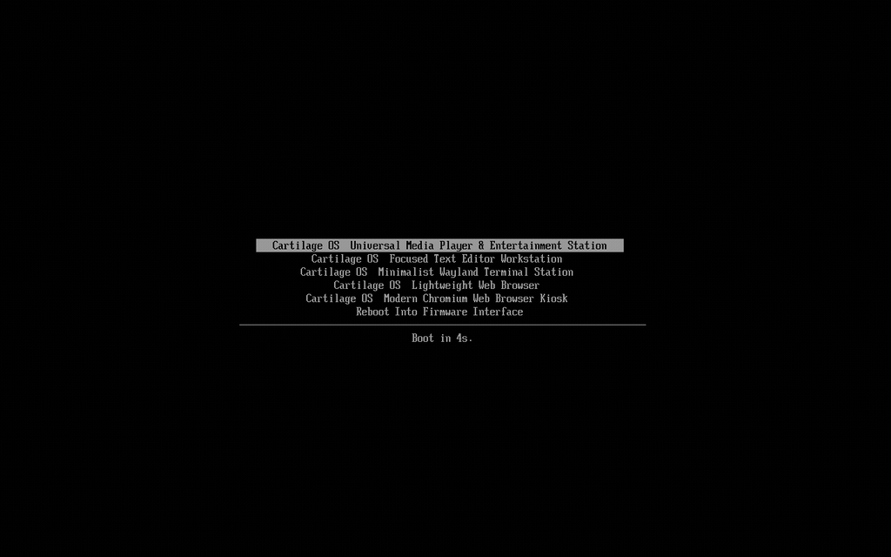
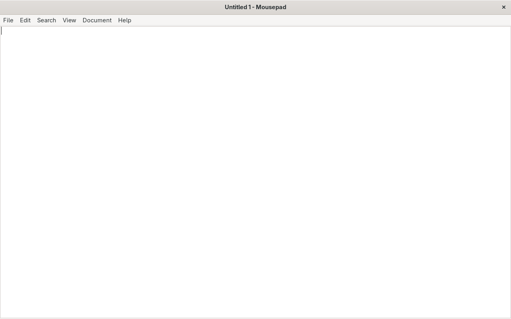
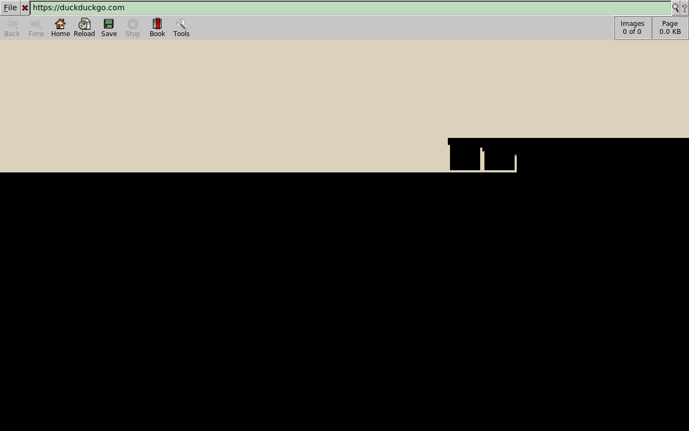

# Cartilage OS

> An ultra-minimal, immutable Linux build framework that compiles standalone applications into read-only, hardware-isolated EROFS cartridges running on a shared kernel with Wayland kiosk composition (`cage`).



---

## 1. What Cartilage OS Is

Cartilage OS is a specialized operating system build framework designed to turn a single USB drive into a multi-application appliance. Instead of distributing full multi-gigabyte ISOs for each application, Cartilage OS packages target applications (from Arch Linux packages or `.deb` archives) into immutable, highly compressed EROFS **cartridges**. Multiple cartridges share a single UEFI bootloader (`systemd-boot`), a single hardened Linux kernel (6.12+), and a unified firmware layer (`linux-firmware`). On boot, the selected cartridge is loop-mounted directly from the storage media, initializing a custom PID 1 `/init` that establishes storage namespaces, starts `seatd`, and launches the application inside a fullscreen Wayland kiosk compositor (`cage`) with zero desktop bloat.

---

## 2. Architecture Overview

```
+-------------------------------------------------------------------------+
|                       UEFI Firmware / OVMF BIOS                         |
+-------------------------------------------------------------------------+
                                     |
                                     v
+-------------------------------------------------------------------------+
|                  systemd-boot Unified Bootloader (ESP)                  |
|    - Cartilage OS — Web Browser (Dillo)      [/dev/vda2, EROFS]         |
|    - Cartilage OS — Text Editor (Mousepad)   [/dev/vda3, EROFS]         |
+-------------------------------------------------------------------------+
                                     |
                                     v
+-------------------------------------------------------------------------+
|                  Shared Linux Kernel (6.12+) + Initramfs                |
+-------------------------------------------------------------------------+
                                     |
                                     v
+-------------------------------------------------------------------------+
|                   Custom PID 1 (/init) Orchestrator                     |
|                                                                         |
|  +------------------------+  +------------------+  +------------------+ |
|  |     Storage Router     |  | seatd GPU Daemon |  | VT2 Console Gate | |
|  | (Ephemeral/Persistent/ |  | (Direct KMS/DRM) |  | (Passcode:       | |
|  |     Host Access)       |  +------------------+  |  cartilage42)    | |
|  +------------------------+          |             +------------------+ |
+--------------------------------------|----------------------------------+
                                       v
+-------------------------------------------------------------------------+
|              App Sandbox Namespace (`unshare -m`)                       |
|   * Hidden host drives unmounted (`umount -l /mnt/hidden_host`)         |
|   * Binaries masked (`mount --bind /dev/null /bin/bash`)                |
|   * Compositor: cage -s -- <target_app> (Wayland Kiosk)                 |
+-------------------------------------------------------------------------+
```

---

## 3. Storage Modes

Cartilage OS supports three deterministic, namespace-isolated storage modes configured at runtime:

1. **Ephemeral Mode**:
   - The root filesystem is mounted from the immutable EROFS cartridge with a `tmpfs` upperdir via `OverlayFS`.
   - Downloads and temporary caches (`/data/downloads`, `/tmp`) are strictly bounded by hard kernel memory quotas (`size=20M`).
   - Integrated `zram` with `zstd` compression actively swaps compressed memory, preventing out-of-memory kernel panics when storage limits are exceeded.
   - All state is wiped completely upon system poweroff or reboot.

2. **Persistent Mode**:
   - The USB storage data partition (ext4 formatted, labeled `CARTDATA`) is detected dynamically (`/dev/vdb` or GPT partition 4).
   - Kernel bind-mounts `/run/persistent_data` to `/data`, allowing user files, workspaces, and application data to survive reboots while keeping the OS cartridge read-only.

3. **Host Access Mode**:
   - Internal physical drives (e.g., host Windows NTFS / Linux partitions) are mounted read-only by default at `/mnt/hidden_host`.
   - Access requires physical entry of the **Developer Passcode** (`cartilage42`).
   - On successful authentication, a specific subdirectory is bind-mounted into the application's workspace inside an isolated mount namespace (`unshare -m`).
   - **NTFS Safety Gate**: If an NTFS partition has its dirty/hibernation bit set (e.g., Windows Fast Startup) or BitLocker encryption active, write requests fail loudly and immediately with actionable remediation instructions, safely dropping access to read-only.

---

## 4. Key Architectural Decisions & Trade-offs

### FUSE vs. Kernel Bind Mounts
- **Decision**: FUSE is completely banned. All isolation and filesystem routing rely exclusively on native Linux kernel bind mounts (`mount --bind`) and mount namespaces (`unshare -m`).
- **Rationale**: FUSE introduces heavy context switching between kernel and userspace, and daemon crashes lead to unkillable D-state processes. Kernel bind mounts have zero runtime memory overhead, native I/O speed, and deterministic lifecycle management.

### EROFS vs. SquashFS
- **Decision**: EROFS with LZ4 compression is used exclusively for cartridge images.
- **Rationale**: EROFS provides substantially superior random-read performance on flash memory, zero-copy decompression paths, and minimal CPU overhead during cold boot on legacy or low-power processors compared to SquashFS.

### The SIGBUS-Accepted Trade-off
- **Decision**: Physical removal of the USB drive mid-session will raise `SIGBUS` if un-cached pages are requested.
- **Rationale**: Cartilage OS does not attempt complex in-memory page locking (`mlock`/`vmtouch`) which would exhaust memory on 1GB RAM targets. Instead, PID 1 treats compositor termination for *any* reason (graceful close or crash) identically: it executes an immediate hard reboot (`reboot -f`). PID 1 never drops to an unauthenticated shell.

### Debug Access via Virtual Terminal 2 (VT2)
- Cartilage OS retains `/bin/bash` in the Arch runtime image but masks it inside the app's mount namespace (`mount --bind /dev/null /bin/bash`).
- Physical debugging is accessible via `Ctrl+Alt+F2` (VT2), gated by the identical Developer Passcode (`cartilage42`). There is no SSH daemon, no network listening port, and no remote attack surface.

### Threat Model Limitation Statement
> **Important Security Boundary** (per `ARCHITECTURE.md` §8):
> Cartilage OS protects against a compromised or malicious application attempting to escalate privileges, escape sandboxes, or write to host storage devices. It does **not** protect against an attacker with physical possession of the USB drive (no LUKS volume encryption in v1).

---

## 5. Measured Benchmarks

All metrics below are physically measured under QEMU with x86_64 architecture, KVM hardware acceleration, Linux 6.12+ shared kernel, and EROFS cartridges:

### 5.1 Multi-Runtime Performance Matrix

| Metric | Mousepad (Alpine musl) | Mousepad (Arch glibc) | Dillo (Arch glibc) | Chromium (Arch glibc) |
| :--- | :--- | :--- | :--- | :--- |
| **Runtime Target** | Alpine Linux v3.20 | Arch Linux | Arch Linux | Arch Linux |
| **C Library / Init** | `musl` / custom `/init` | `glibc` / custom `/init` | `glibc` / custom `/init` | `glibc` / custom `/init` |
| **Display Mode** | Pure Wayland (`cage`) | Pure Wayland (`cage`) | Xwayland (`cage`) | Ozone Wayland (`cage`) |
| **Image Size (bytes)** | **47,063,040 bytes** | 1,220,939,776 bytes | 1,143,693,312 bytes | 777,035,776 bytes |
| **Image Size (Human)** | **44.8 MB** | 1.14 GB | 1.06 GB | 741 MB |
| **Cold Boot Latency** | **4.29s** | 30.21s | 36.36s | **5.63s** |
| **Idle RAM (Used)** | **57.6 MB** | 262 MB | 285 MB | 552 MB |
| **Idle RAM (Available)** | **757.7 MB** (of 1GB) | 690 MB (of 1GB) | 666 MB (of 1GB) | 1.4 GB (of 2GB) |
| **Build Time** | **20s** | 48s | 38s | ~60s |

### 5.2 Direct Impact: Alpine (`musl`) vs. Arch (`glibc`) for `mousepad`

| Attribute | Arch Linux Runtime | Alpine Linux Runtime | Impact / Gain |
| :--- | :--- | :--- | :--- |
| **Cartridge Disk Footprint** | 1.14 GB (1,220 MB) | **44.8 MB (47 MB)** | **96.1% size reduction** |
| **Idle RAM Consumption** | 262 MB | **57.6 MB** | **78.0% memory reduction** |
| **Cold Boot Latency** | 30.21s | **4.29s** | **85.8% latency reduction** |
| **Hermetic Build Time** | 48s | **20s** | **58.3% build speedup** |

*Detailed benchmark logs and exact measurement commands are documented in [`BENCHMARKS.md`](BENCHMARKS.md).*

---

## 6. Screenshots

| Cartridge: Mousepad (GTK3 / Wayland) | Cartridge: Dillo (FLTK / Xwayland) |
| :---: | :---: |
|  |  |

---

## 7. Step-by-Step Reproduction Guide

Follow these steps from a clean Linux environment (Ubuntu 24.04 LTS or Arch Linux with root / sudo permissions) to build and run Cartilage OS from scratch.

### 7.1 Install Host Dependencies

```bash
# Ubuntu / Debian WSL2:
sudo apt update && sudo apt install -y \
  qemu-system-x86 ovmf erofs-utils arch-install-scripts \
  util-linux e2fsprogs ntfs-3g ffmpeg curl git

# Arch Linux:
sudo pacman -Syu --noconfirm \
  qemu-system-x86 ovmf erofs-utils arch-install-scripts \
  util-linux e2fsprogs ntfsprogs ffmpeg
```

### 7.2 Build the Shared Base Rootfs

```bash
# Clone repository
git clone https://github.com/example/cartilage.git
cd cartilage

# Run Part 1 setup script to create base rootfs with kernel & firmware
sudo ./scripts/01_test_qemu.sh
```

### 7.3 Build Application Cartridges

Use the `build_cartridge.sh` CLI to create hermetic EROFS images:

```bash
# Build text editor cartridge (Mousepad) on Arch runtime
sudo ./build_cartridge.sh --app mousepad --runtime arch

# Build web browser cartridge (Dillo) on Arch runtime
sudo ./build_cartridge.sh --app dillo --runtime arch

# Build lightweight sub-50MB cartridge on Alpine Linux (musl) runtime
sudo ./build_cartridge.sh --app mousepad --runtime alpine

# Build modern web kiosk cartridge (Chromium) on Arch runtime
sudo ./build_cartridge.sh --app chromium --runtime arch

# Build from a local .deb package (Debian compatibility mode)
sudo ./build_cartridge.sh --app /path/to/package.deb --runtime arch
```

### 7.4 Create Unified Multi-Boot UEFI Disk Image or Flash Physical USB

#### Option A: Create Virtual Combined Image (for QEMU testing)
```bash
sudo ./scripts/07_test_boot_menu.sh
```

#### Option B: Flash Directly to Bare-Metal USB Drive
```bash
# Safely inspects block device (refuses fixed NVMe/SATA internal drives),
# formats GPT layout, installs UEFI fallback loader, and flashes cartridges:
sudo ./scripts/13_flash_usb.sh /dev/sdX
```

### 7.5 Booting in QEMU

#### Option A: Boot Combined Multi-App UEFI Drive
```bash
qemu-system-x86_64 \
  -drive file=build/cartilage_combined.img,format=raw \
  -vga virtio -serial stdio -m 1024M \
  -bios /usr/share/OVMF/OVMF_CODE.fd
```
*The `systemd-boot` menu will appear with entries for both cartridges.*

#### Option B: Boot Single Cartridge Directly
```bash
qemu-system-x86_64 \
  -kernel /var/lib/cartilage/rootfs/boot/vmlinuz-linux \
  -initrd /var/lib/cartilage/rootfs/boot/initramfs-linux.img \
  -drive file=build/cartridge_mousepad.img,format=raw,if=virtio \
  -append "console=ttyS0 root=/dev/vda rootfstype=erofs init=/init" \
  -vga virtio -serial stdio -m 1024M
```

#### Option C: Accessing the Debug Console (VT2)
1. While the cartridge is running in QEMU, press `Ctrl+Alt+F2` (or in the QEMU monitor type `sendkey ctrl-alt-f2`).
2. At the prompt `[auth] Enter Developer Passcode:`, enter `cartilage42`.
3. You will enter a root debug shell with access to `dmesg`, `ip link`, and system diagnostics.

---

## 8. Verification Suites

The repository contains end-to-end automated verification scripts for every specification milestone:

- `scripts/01_test_qemu.sh` — Base rootfs generation & minimal QEMU boot.
- `scripts/02_test_cartridge_qemu.sh` — Wayland compositor (`cage`) & EROFS cartridge execution.
- `scripts/03_test_ephemeral_storage.sh` — OverlayFS `tmpfs` quota bounds & zram swap validation.
- `scripts/04_test_persistent_storage.sh` — Multi-stage reboot persistence verification.
- `scripts/05_test_host_access.sh` — Passcode gating, dirty NTFS rejection, & mount isolation.
- `scripts/06_test_builder_cli.sh` — Multi-app hermetic build validation & `.deb` package support.
- `scripts/07_test_boot_menu.sh` — UEFI `systemd-boot` multi-cartridge menu verification.
- `scripts/08_test_debug_console.sh` — VT2 passcode gate & app namespace binary masking verification.
- `scripts/09_run_benchmarks.sh` — Automated performance benchmark suite.
- `scripts/10_test_networking.sh` — Network & DNS subsystem verification (DHCP lease, direct IP, DNS lookup).
- `scripts/11_test_audio.sh` — Audio subsystem verification (ALSA PCM open, dmix multi-stream mixing, sound generation).
- `scripts/12_test_chromium.sh` — Modern Web Kiosk verification (Ozone Wayland kiosk, zygote sandbox, fontconfig).
- `scripts/13_test_flasher.sh` — Bare-metal physical USB flasher verification (block safety, GPT layout, PARTLABEL routing).
- `scripts/14_test_alpine_cartridge.sh` — Alpine lightweight runtime verification (<50MB EROFS cartridge, musl, apk).
